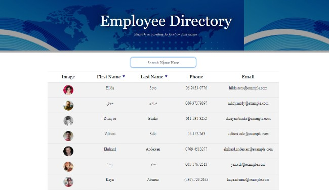
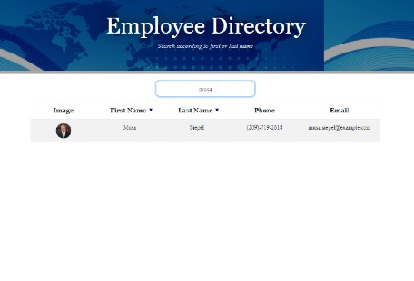

# 🔗 [Employee Directory](https://github.com/kjhallam/19_employee_directory.git)

## LICENSE

---

## 📓 DESCRIPTION

* As a user, I want to be able to view my entire employee directory at once so that I have quick access to their information.

- The user is allowed to search the directory of employees using the first and last name. 
- In addition they would be able to sort according to ascending and descending by selecting the arrow next to First Name and Last Name.

---

## 📋 Table of Contents

  1. [DESCRIPTION](#description)
  2. [INSTALLATION](#installation)
  3. [USAGE](#usage)
  4. [CONTRIBUTING](#contributing)
  5. [TEST](#test)
  6. [GITHUB](#github)
  7. [PREVIEW](#preview)
  7. [QUESTIONS](#questions)
  
---

## ⬇️ INSTALLATION

Material UI & npm i

---

## 📓 USAGE

Used RandomUser API to generate a list of 100 employers.
- User can select the arrows in the table to display ascending or descending order of the employee list.
- User can also enter a first name or last name to display a specific person from the list of generated list.

---

## 📓 CONTRIBUTING

N/A

---

## 🧪 TEST

N/A

---

## :octocat: GITHUB

[https://github.com/kjhallam](http://github.com/https://github.com/kjhallam)

---

## 📷 SCREENSHOTS

---

## ❔ QUESTIONS

If any questions concerning the use of the markdown file contact me at ✉️ [Email](kjhallam321@gmail.com).
